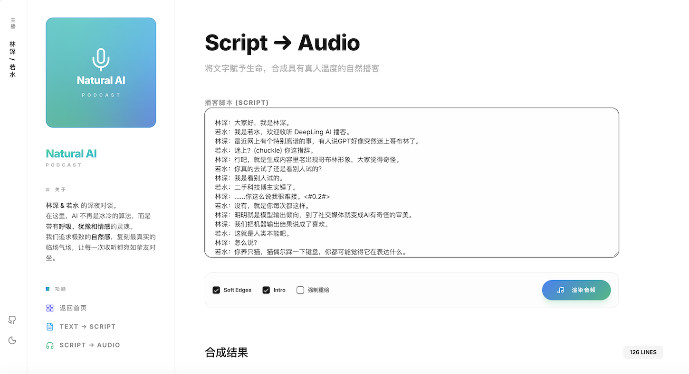

# Natural AI Podcast

> **AI 驱动的自然质感对谈播客系统。** 结合 4 阶段 LLM 脚本优化管线与 MiniMax 高级 TTS 技术，打造像真人一样闲聊的播客体验。

[](https://astro.build/)
[](https://react.dev/)
[](https://fastapi.tiangolo.com/)
[](LICENSE)

---



---

## 核心特性

- **4 阶段脚本管线**：任意素材 → 基础改写 → 节奏调整 → 聊天质感注入 → 最终审核，支持 MiniMax M2.7 等多种 LLM。
- **真人质感播客**：基于 MiniMax TTS 引擎，支持林深、若水双角色自然对谈，自动注入停顿 `<#0.2#>` 与情绪标签 `(chuckle)`。
- **极致视觉设计**：线性极简布局，融合高对比度纯净感与蓝绿渐变科技美学。
- **响应式三栏布局**：侧边栏持久化、全局播放器、深色模式完美适配，支持全站无刷新页面跳转。

---

## 脚本生成管线

任意文本素材（文章、笔记、新闻等）经过 4 个阶段的 LLM 处理，逐步从"信息搬运"变成"真人闲聊"。每一步的输出作为下一步的输入，中间文件保存在 run 目录下供调试。

### Stage 1：基础改写（01-base.md）

**目标**：把原始素材改写成双主持人对话脚本。

- 纯文本格式，每行 `林深：...` 或 `若水：...`，中文全角冒号分隔
- 保留原文事实，不编造新事实、不添加原文没有的比喻
- 写成自然对话，避免一人一大段轮流念稿
- 固定开头：`林深：大家好，我是林深。` / `若水：我是若水，欢迎收听 DeepLing AI 播客。`
- 固定结尾：`林深：我是林深。` / `若水：我是若水，我们下期见。`
- 不加任何口头禅、语气词、停顿标签（留给后续阶段）

### Stage 2：节奏调整（02-rhythm.md）

**目标**：调整对话回合长度分布，让节奏像真人聊天。

- 70% 中等长度（15-60 字）：主体内容，像真人聊天
- 20% 短句（4-15 字）：接话、确认、过渡点缀
- 10% 较长（最长 80 字）：解释复杂概念
- 不连续超过 3 个极短回合
- 超过 80 字的长发言拆开，让另一位主持人接话
- 不加新事实、新比喻、新例子

### Stage 3：口语质感注入（03-texture.md）

**目标**：在保持事实的前提下加入真实聊天的"不完美感"。

允许添加（少量、分散）：
- 口语词：嗯、呃、怎么说呢
- 互动：对吧？你觉得呢？你说是不是？
- 回退修正：不是……应该说……、我换个说法
- 停顿标签：`<#0.2#>`、`<#0.25#>`、`<#0.3#>`
- 情绪标签：`(chuckle)`、`(breath)`、`(emm)`、`(sighs)`

严格禁止：
- 全角中文标签（笑）、（叹气）等
- 不在允许列表内的英文标签
- 开头问候和结尾告别行加标签
- 超过 40% 的句子带标签或口头禅

### Stage 4：审查修正（04-final.md）

**目标**：审查并修正前三步可能引入的问题。

- 格式修正：移除 Markdown、确保行格式正确、消除空行
- 标签修正：中文标签转英文、删除不合规标签、停顿标签不超过 `<#0.3#>`
- 内容修正：合并过多极短句、拆分过长发言、删除多余标签、删除原文没有的比喻
- 删除所有非对话内容（LLM 输出的分析过程、说明文字等）

---

## 音频渲染流程

最终脚本通过 MiniMax TTS 引擎逐行合成语音，再经 ffmpeg 拼接：

1. **逐行 TTS**：每行对话独立调用 MiniMax TTS，根据说话人选择对应 voice_id
2. **Soft Edges**：对每个 segment 做音量渐入渐出处理，消除拼接时的突兀感
3. **拼接合成**：使用 ffmpeg concat demuxer 合并所有 segment，并做 loudnorm 响度归一化
4. **Deepling 品牌版**：在对话前后加上 intro/outro 音乐，输出完整播客音频

---

## 技术架构

### 前端 (Frontend)
- **Framework**: Astro 6.0 (SSG/SPA Hybrid)
- **UI Library**: React 19
- **Icons**: Lucide Icons
- **Transitions**: Astro Client Router (View Transitions)
- **Styling**: Mesh Gradient + Glassmorphism (CSS)

### 后端 (Backend)
- **Framework**: FastAPI (Python 3.10+)
- **TTS Engine**: MiniMax Voice 2.8
- **Audio Process**: FFmpeg (音频剪辑、合成与归一化)

---

## 快速开始

### 1. 克隆项目
```bash
git clone https://github.com/wang-h/natural-ai-podcast.git
cd natural-ai-podcast
```

### 2. 配置环境
在根目录创建 `.env` 文件，填入必要的 API Key：
```env
# MiniMax API
MINIMAX_API_KEY="your_minimax_key"

# TTS Configuration
MINIMAX_TTS_MODEL=speech-2.8-hd

# Host Voice IDs (optional, defaults provided)
HOST_A_VOICE_ID=Chinese (Mandarin)_Southern_Young_Man
HOST_B_VOICE_ID=Chinese (Mandarin)_HK_Flight_Attendant
```

### 3. 安装依赖
#### 后端 (Python)
```bash
pip install -r requirements.txt
```
#### 前端 (Node.js)
```bash
cd frontend
npm install
npm run build  # 编译静态文件到 dist 目录
```

### 4. 启动服务
```bash
# 回到项目根目录
python main.py
```
访问 `http://localhost:8700` 即可开始使用。

> **注意**：脚本生成和音频渲染涉及多步 LLM 调用与逐行 TTS 合成，完整流程可能需要数分钟。如果不想等待，可以直接查看 `runs/` 目录下已有的生成结果（包含各阶段脚本和音频文件）。

---

## 开源协议

本项目基于 **MIT License** 协议开源。

---

Developed with [wang-h](https://github.com/wang-h)
